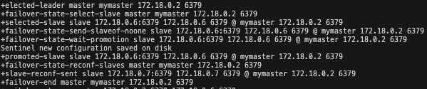
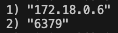
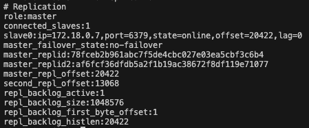
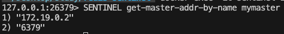

# Redis 분산
작은 프로젝트에서는 보통 하나의 Redis로 구성되어, 애플리케이션을 운영한다. 하지만 시스템이 커져 갈수록 Redis I/O가 늘어남에 따라, 장애가 발생할 수도 있다. 하지만 Redis를 1대만 운용하는 것은 장애가 발생하게 되면 시스템에 문제가 생길 수도 있다.

## Redis Sentinel
Redis Sentinel은 Redis의 고가용성(HA)을 지원하는 관리 시스템이다. 모니터링을 통해 Master와 Replica Redis Server가 살아있는지 확인하고, 자동 장애 복구 기능을 제공한다. 

대체적은 구성은 다음과 같다.
- Sentinel 3대가 Redis Master를 감시한다. 
- Master가 죽으면, 투표(Quorum)를 해서 새로운 Master를 뽑는다.
- 새로운 Master로 Replica들이 재복제하고, 클라이언트에게도 알린다.

### 실습 구성
실습에 앞서, Docker 환경에서 Redis-Sentinel을 실습하기 위해 실무에서 쓰이는 환경과 다를 수 있다. 하지만  구현해본다는 관점에서 진행하였으니, 이 점 참고 바란다.

**docker-compose.yaml**

총 6개의 컨테이너로 Redis-Sentinel을 구현할 것이다. 구성은 다음과 같다.
- `redis-master`
- `redis-replica-1`
- `redis-replica-2`
- `redis-sentinel-1`
- `redis-sentinel-2`
- `redis-sentinel-3`

docker-compose.yaml의 내용은 다음과 같다.
[docker-compose.yaml](../docker-compose.yaml)

> **Sentinel**은 왜 3대를 사용할까?
각각의 Redis Instance들은 네트워크 환경에 대해서 분리되어 있는 것이 기본이다. 여러 서버가 아닌 한 대의 서버에 여러 Redis를 구성하게 되면 해당 서버가 죽어버리면 소용이 없기 때문이다. 그렇기 때문에 네트워크 상황이나, 다른 변수에 따라 Sentinel이 Master Redis가 죽었다고 판단할 수 있다. 그래서 여러 대의 Sentinel을 구성해두고, 각각 투표를 통해 Master Redis 시스템이 죽었는지 살았는지 결정해야 하기 때문에 최소 3개 이상의 Sentinel이 필요하다.

**sentinel.conf**
sentinel.conf 파일은 각각의 Sentinel Instance의 설정 정보를 담고 있다.
```conf
port 26379 # 포트 설정

# 모니터 할 Master Redis 
sentinel monitor mymaster redis-master 6379 2 

# Master가 다운되었을 때 상태 판단 시간 (5초 동안 Master에 응답이 없으면 Down 되었다고 판단)
sentinel down-after-milliseconds mymaster 5000 

# Failover 과정을 완료하기 위한 최대 시간 (10초 안에 Failover가 완료되어야 한다.)
sentinel failover-timeout mymaster 10000 

# Master에 대한 인증 절파 
sentinel auth-pass mymaster masterpass

# Sentinel이 master/slave의 호스트 이름을 IP로 해석하려고 시도할지 결정하는 설정
sentinel resolve-hostnames yes
```

해당 설정을 마운트 시켜, `Sentinel`을 구성한다. 

## 실행

```bash
docker compose up -d
```

### 테스트
이제 Master를 down 시켜보자.

```bash
docker stop redis-master
```

그런 후에 각각 Sentinel의 로그를 살펴보자.

```bash
# sentinel-2와 sentinel-3도 각각 살펴본다.
docker logs -f sentinel-1
```



`redis-master`를 삭제하게 되면 다음과 같이 각각의 sentinel들이 투표를 하게 되고, 우리가 정한 임계값 (2) 을 넘게되면, Replica Redis Instance 중 하나를 Master로 승격시킨다. 

승격이 완료된 뒤에 Sentinel의 서버에서 다음 명령어로 Master를 확인해보면
```bash
redis-cli > SENTINEL get-master-addr-by-name {모니터링 하고 있는 Master 이름}
```

다음과 같이 다른 Replica Redis Instance의 주소가 저장되어 있는 것을 확인할 수 있다.

 

또는, **Master**로 승격된 이전 `Replica Redis Instance`에서 `info replication` 를 입력하면 `role:master` 를 확인할 수 있다.




이 때 삭제한 `redis-master`를 다시 살리게 되면 해당 인스턴스가 다시 **Master**가 되는 것이 아닌, `Replication`으로 들어가게 된다. 

**Master**로 승격하게 된 `replica`를 다시 삭제하게 되면 하나 남은 Replica Redis Instance와 복구된 `redis-master`에 대해 `Sentinel`들이 각각 투표를 하게 되고, 그 중 하나가 Master로 승격되게 된다. 이런식으로 순환되면서 계속해서 **고가용성(HA)**을 유지한다. 


**현재 상태 확인하기**
Sentienl이 Master를 감시하고 있는지 확인하기

```bash
docker exec -it sentinel-1 redis-cli -p 26379
```

그럼 다음과 같은 결과를 받을 수 있다.


`Sentinel`이 바라보고 있는 Master(`mymaster`) 의 `Host`와 `Port`를 확인할 수 있다.

**Replication 정보 확인**
아래 명령어를 통해 해당 Redis의 Role과 Replication 상태를 확인할 수 있다.
```bash
redis-cli > info replication
```
